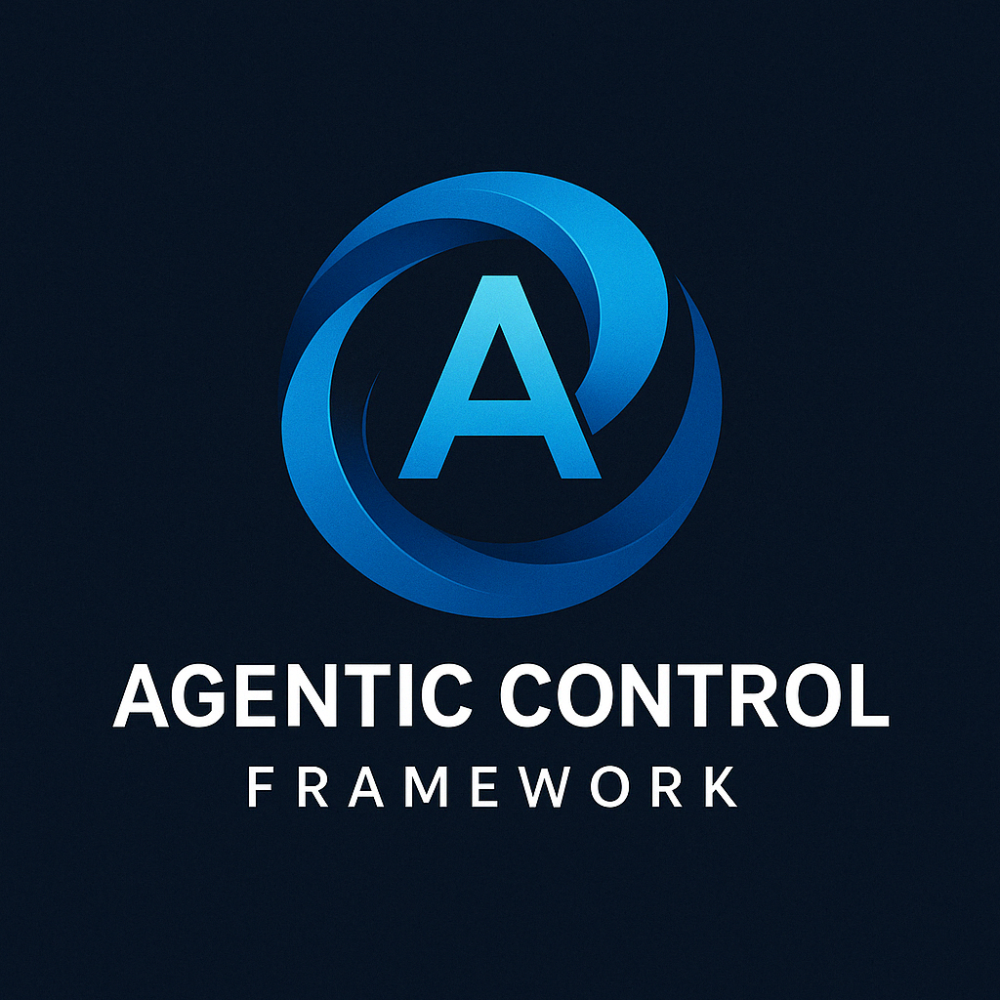

# Agentic Control Framework

A powerful CLI and MCP-based task management system for agentic workflows.



## Overview

The Agentic Control Framework (ACF) is a comprehensive task management system designed to bring structure and organization to your development projects. It offers:

- **CLI-based task management:** Create, update, and track tasks using simple commands
- **MCP integration:** Seamlessly connect with Cursor IDE for enhanced productivity
- **AI-powered features:** Break down tasks into subtasks, adapt to changing requirements
- **Progress tracking:** Monitor task status, dependencies, and completion
- **Customizable workflows:** Adapt to your specific project needs

## Features

- Create and manage tasks with priorities, descriptions, and dependencies
- Break down complex tasks into manageable subtasks
- Track task status (todo, inprogress, done, blocked, error)
- Generate Markdown documentation for tasks
- Parse PRD (Product Requirements Document) files to auto-generate tasks
- Use AI to expand tasks into detailed subtasks
- Revise task plans when requirements change
- Integrate with Cursor IDE through MCP (Model Control Protocol)

## Installation

### Prerequisites

- Node.js (v14 or later)
- npm (comes with Node.js)

### Installation Steps

1. Clone the repository:
   ```
   git clone https://github.com/FutureAtoms/agentic-control-framework.git
   cd agentic-control-framework
   ```

2. Install dependencies:
   ```
   npm install
   ```

3. Make scripts executable:
   ```
   chmod +x bin/task-manager bin/task-manager-mcp
   ```

4. Create a `.env` file with your API key (optional, but required for AI features):
   ```
   GEMINI_API_KEY=your_api_key_here
   ```

## Project Structure

The Agentic Control Framework has a clean and organized project structure:

```
agentic-control-framework/
├── bin/
│   ├── task-manager      # CLI entry point
│   ├── task-manager-mcp  # Legacy MCP server wrapper for Cursor IDE
│   ├── agentic-control-framework-mcp  # New MCP server wrapper for Cursor IDE
├── src/
│   ├── cli.js            # CLI command definitions
│   ├── core.js           # Core functionality
│   ├── logger.js         # Standardized logging
│   ├── mcp_server.js     # MCP server implementation
│   └── prd_parser.js     # PRD parsing functionality
├── package.json
└── README.md
```

## Setting up with Cursor IDE

To use the Agentic Control Framework with Cursor IDE, you need to set up the MCP server wrapper:

1. Make the MCP server wrapper executable:
   ```
   chmod +x bin/task-manager-mcp
   chmod +x bin/agentic-control-framework-mcp
   ```

2. Link the script for system-wide use (optional):
   ```
   # Install globally (may require sudo)
   sudo ln -s "$(pwd)/bin/agentic-control-framework-mcp" /usr/local/bin/agentic-control-framework-mcp
   
   # Or add to your PATH in .bashrc or .zshrc
   export PATH="$PATH:/path/to/agentic-control-framework/bin"
   ```

3. Configure Cursor MCP connection:
   - Open Cursor settings
   - Go to Extensions > MCP > Add connection
   - Add a new connection with these details:
     - Name: `Agentic Control Framework`
     - Command: Path to your `bin/agentic-control-framework-mcp` script
     - Extension ID: Any unique identifier you prefer

4. Now you can use ACF within Cursor by triggering the MCP extension

## CLI Commands

The Agentic Control Framework provides a command-line interface for managing tasks:

```
./bin/task-manager <command> [options]
```

### MCP Server

Launch the MCP server for integration with Cursor:

```
./bin/agentic-control-framework-mcp
```

Or use the legacy name:

```
./bin/task-manager-mcp
```

### Initialize a Project

Initialize a task management project:

```
./bin/task-manager init
```

With specific name and description:

```
./bin/task-manager init --project-name "My Project" --project-description "Description of my project"
```

### Add a Task

Add a new task:

```
./bin/task-manager add -t "Implement login feature"
```

With description and priority:

```
./bin/task-manager add -t "Implement login feature" -d "Create user authentication system" -p high
```

### List Tasks

List all tasks:

```
./bin/task-manager list
```

Filter by status:

```
./bin/task-manager list -s todo
```

### Get Next Task

Get the next actionable task based on status, dependencies, and priority:

```
./bin/task-manager next
```

### Add a Subtask

Add a subtask to a specific parent task:

```
./bin/task-manager add-subtask 1 -t "Design login form"
```

### Update Task Status

Change the status of a task:

```
./bin/task-manager status 1 inprogress -m "Starting work on this task"
./bin/task-manager status 1 done -m "Completed implementation"
```

### Get Task Context

Get detailed context for a specific task:

```
./bin/task-manager get-context 1
```

### Remove a Task

Remove a task by ID:

```
./bin/task-manager remove 1
```

### Generate Task Files

Generate Markdown files for all tasks:

```
./bin/task-manager generate-files
```

### Parse PRD

Parse a Product Requirements Document to generate tasks:

```
./bin/task-manager parse-prd path/to/prd.md
```

### Expand Task

Break down a task into subtasks using AI:

```
./bin/task-manager expand-task 1
```

### Revise Tasks

Revise future tasks based on a prompt:

```
./bin/task-manager revise-tasks 3 -p "Change authentication from OAuth to JWT"
```

## Creating a PRD

A Product Requirements Document (PRD) is the starting point for your project in Agentic Control Framework. The system can parse this document to automatically generate tasks based on your project requirements.

### Sample PRD Format

Here's a simple example of how to structure your PRD:

```markdown
# E-Commerce Application PRD

## User Authentication
- Implement user registration with email verification
- Create secure login system with password recovery
- Add social media login options (Google, Facebook)

## Product Management
- Create product catalog with categories and search
- Implement product details page with images and specifications
- Add inventory management system

## Shopping Cart
- Design cart UI with product thumbnails and quantities
- Implement add-to-cart and remove functionality
- Create cart summary with pricing details

## Checkout
- Build multi-step checkout process
- Implement address management
- Add payment method integration
```

### PRD Best Practices

1. **Use clear headings**: Each major feature should have its own heading (##)
2. **List specific requirements**: Use bullet points (-) to list individual requirements
3. **Be specific**: The more detailed your requirements, the better the generated tasks
4. **Logical organization**: Group related requirements together under appropriate headings
5. **Include dependencies**: If possible, mention when one feature depends on another

When the PRD is parsed, each major heading typically becomes a task, and bullet points become subtasks or descriptions.

## Example Workflow

Here's a complete workflow with the Agentic Control Framework:

```bash
# Step 1: Create a PRD (Product Requirements Document)
# First, create a PRD file that describes your project requirements
# Example: Create a file named "project_prd.md" with your project requirements

# Step 2: Initialize the project
./bin/task-manager init --project-name "E-Commerce App" --project-description "A modern e-commerce application with user authentication, product listings, and checkout"

# Step 3: Parse the PRD to automatically generate tasks
./bin/task-manager parse-prd path/to/project_prd.md

# Step 4: Use other functions to manage and update tasks
# List all generated tasks
./bin/task-manager list

# Expand a task into subtasks
./bin/task-manager expand-task 1

# Get the next actionable task
./bin/task-manager next

# Update task status
./bin/task-manager status 1.1 inprogress -m "Working on login form design"

# Mark task as done
./bin/task-manager status 1.1 done -m "Completed login form design"

# Add a new task manually if needed
./bin/task-manager add -t "New Requirement: Payment Gateway" -p high

# Revise tasks based on changing requirements
./bin/task-manager revise-tasks 3 -p "Change authentication from OAuth to JWT"

# Generate documentation
./bin/task-manager generate-files
```

> **Important Note**: Following the correct workflow order is essential. Starting with a PRD and parsing it allows the system to generate a comprehensive task structure based on project requirements. This initial structure can then be further refined and managed with other commands.

## Troubleshooting

- Make sure your scripts are executable: `chmod +x bin/task-manager bin/task-manager-mcp`
- Check that your `.env` file contains the API key if you're using AI features
- Verify your Node.js version (`node -v`) is v14 or later
- Check the paths in the bin/task-manager-mcp script match your installation

## Best Practices

- Start with a well-defined PRD (Product Requirements Document) that outlines all project requirements
- Follow the recommended workflow order: 1) Create PRD, 2) Initialize project, 3) Parse PRD, 4) Use other commands
- Always run `task-manager init` in a new project directory before using other commands
- Use meaningful task titles and descriptions
- Set appropriate dependencies between tasks
- Update task status regularly to keep your project dashboard accurate
- Use the `next` command to maintain focus on the most important tasks
- Leverage AI expansion for complex tasks
- Use task revision when project requirements change instead of manually updating each task

## License

ISC

## Author

Abhilash Chadhar
 