# ACF Architecture Documentation

**Author:** Abhilash Chadhar (FutureAtoms)
**Last Updated:** January 2025

## System Overview

The Agentic Control Framework (ACF) is designed as a modular, scalable system that provides autonomous agent capabilities through multiple interfaces and deployment modes.

## High-Level Architecture

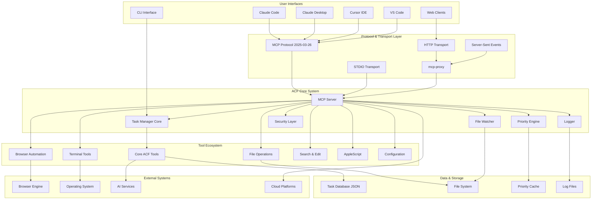

## Core Components

### 1. MCP Server (`src/mcp_server.js`)

The central hub that implements the MCP protocol and coordinates all tool operations.

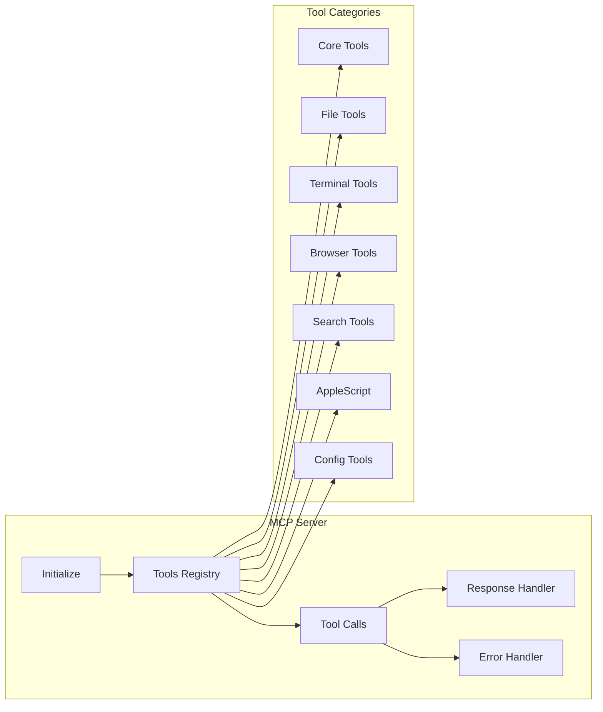

**Key Responsibilities:**
- Protocol negotiation and capability declaration
- Tool registration and discovery
- Request routing and response formatting
- Error handling and logging
- Security enforcement

### 2. Task Manager Core (`src/core.js`)

Manages task lifecycle, dependencies, and data persistence.

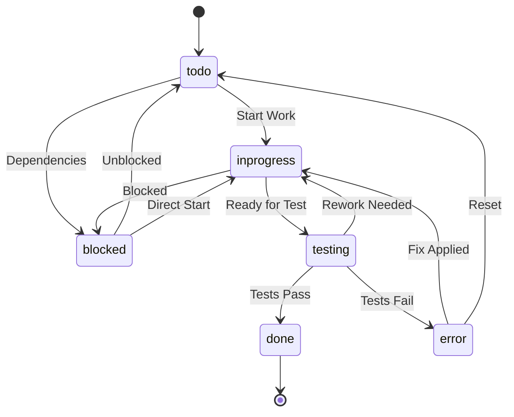

**Key Features:**
- CRUD operations for tasks and subtasks
- Status workflow management
- Dependency tracking and validation
- Activity logging and audit trail
- Data persistence and caching

### 3. Priority Engine (`src/priority_engine.js`)

Advanced priority calculation and optimization system.

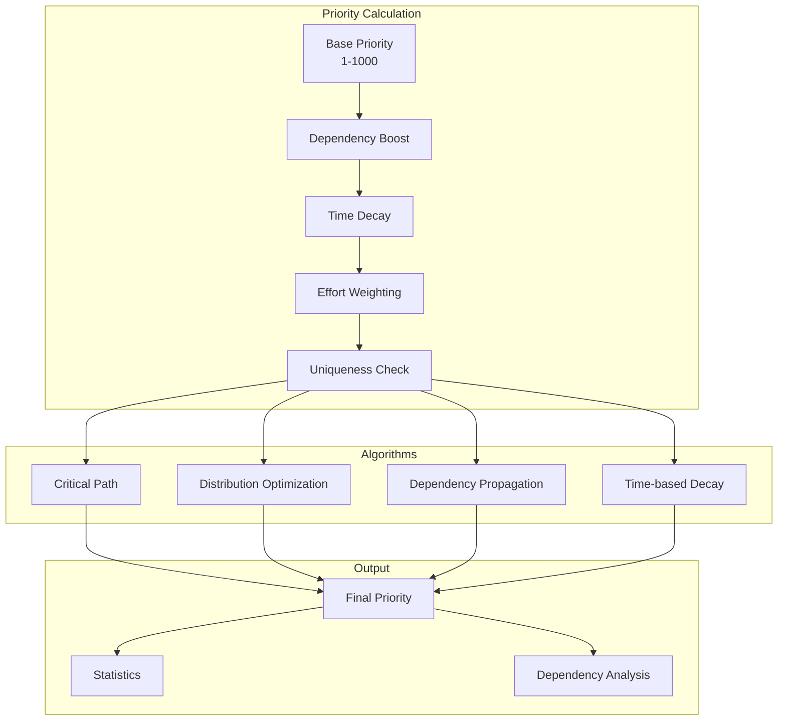

## Tool Architecture

### Tool Registration System

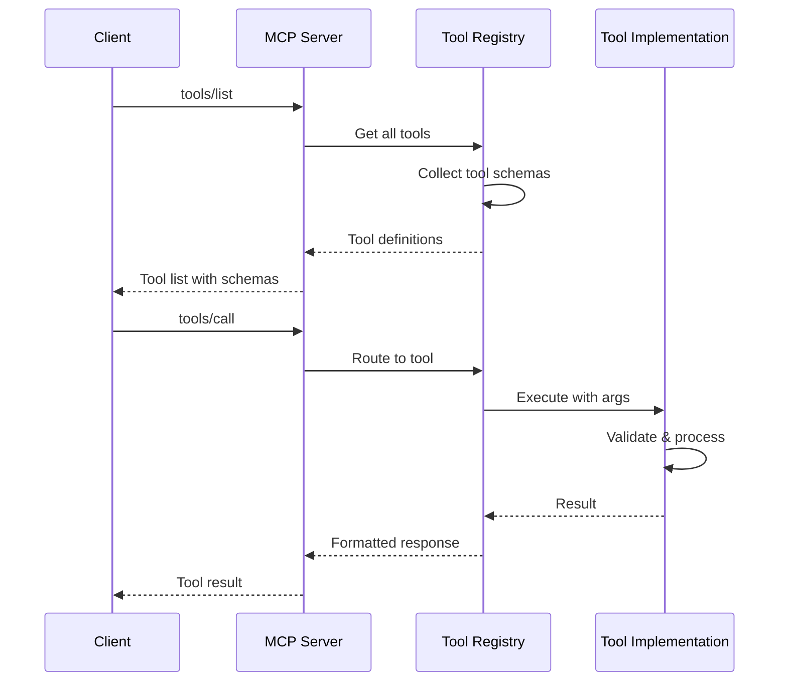

### Security Model

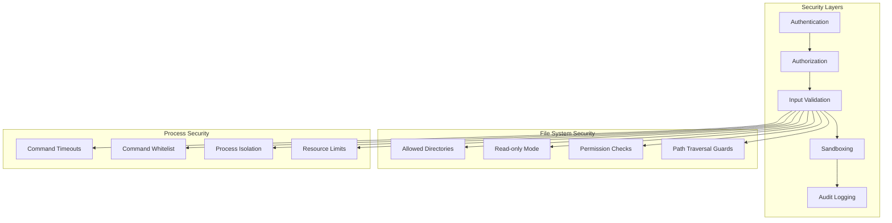

## Deployment Architectures

### Local Development

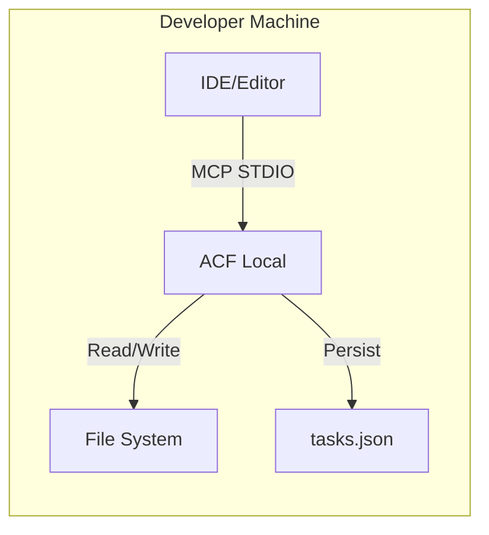

### Cloud Deployment

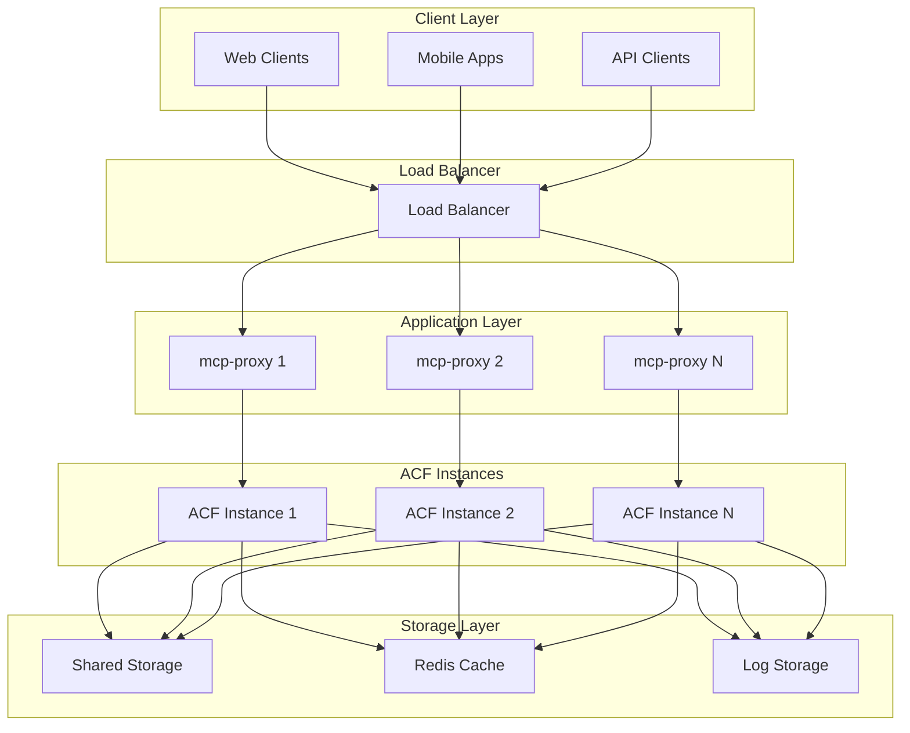

## Data Flow

### Task Management Flow

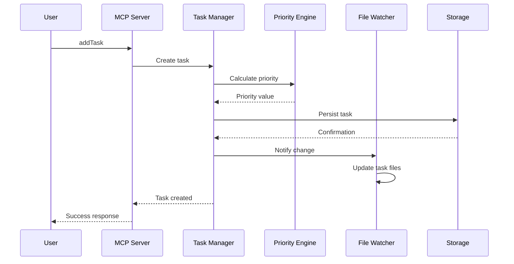

### File Operation Flow

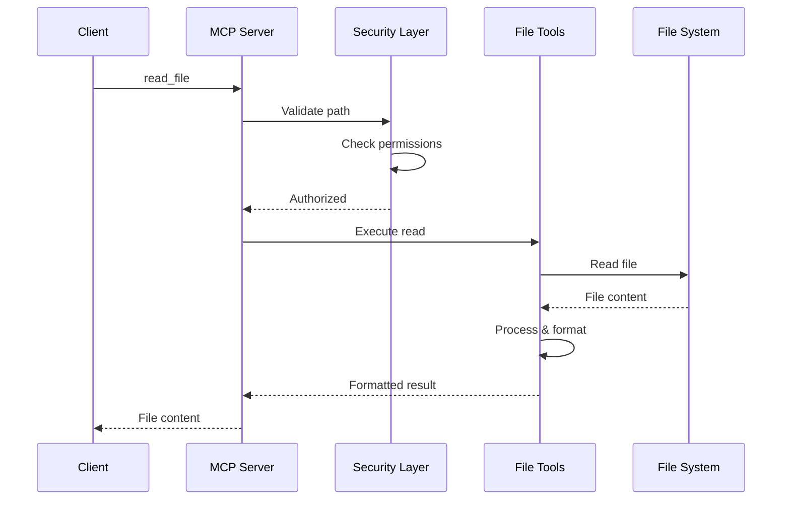

## Performance Considerations

### Caching Strategy

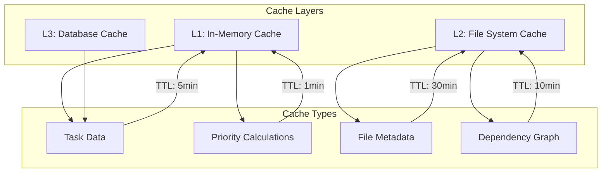

### Scaling Patterns

- **Horizontal Scaling**: Multiple ACF instances behind load balancer
- **Vertical Scaling**: Increased resources per instance
- **Caching**: Multi-layer caching for performance
- **Async Processing**: Background task processing
- **Connection Pooling**: Efficient resource utilization

## Extension Points

### Custom Tool Development

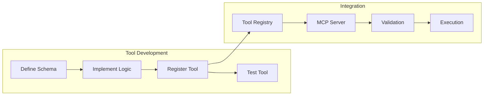

### Plugin Architecture

- **Tool Plugins**: Custom tool implementations
- **Priority Plugins**: Custom priority algorithms
- **Transport Plugins**: Custom communication protocols
- **Storage Plugins**: Custom persistence layers
- **Security Plugins**: Custom authentication/authorization

This architecture provides a solid foundation for building autonomous agents while maintaining flexibility, security, and scalability.
