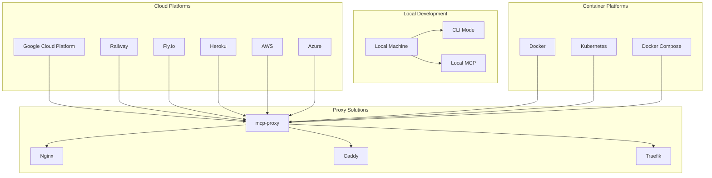
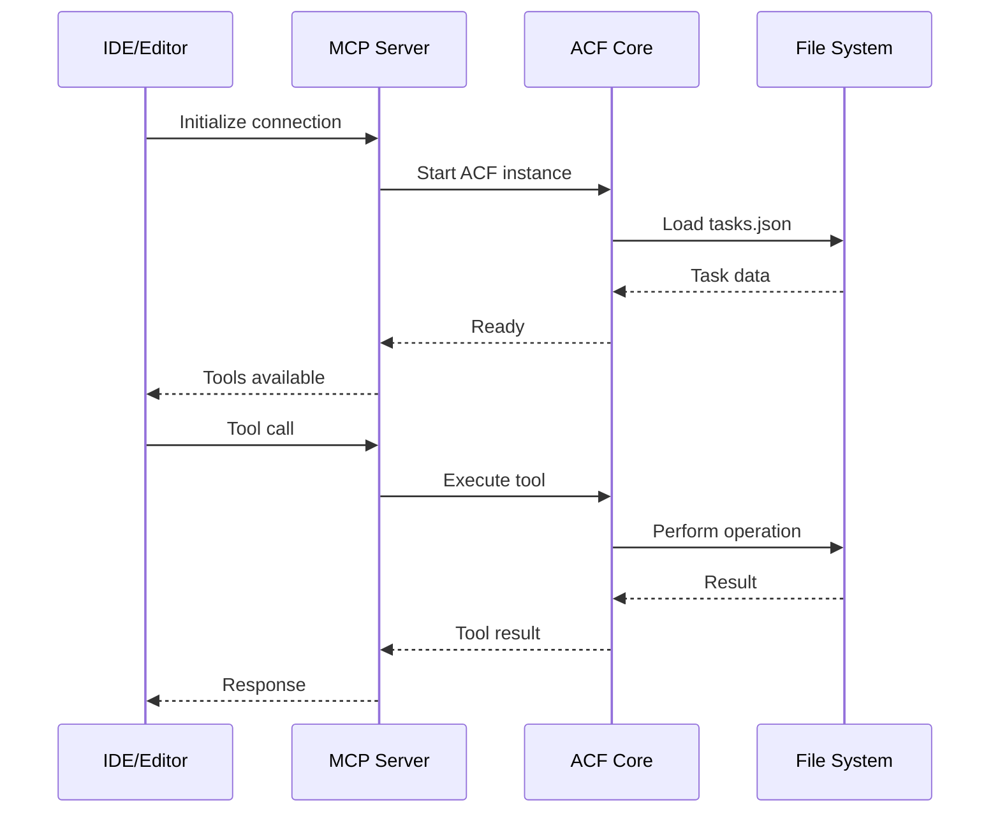
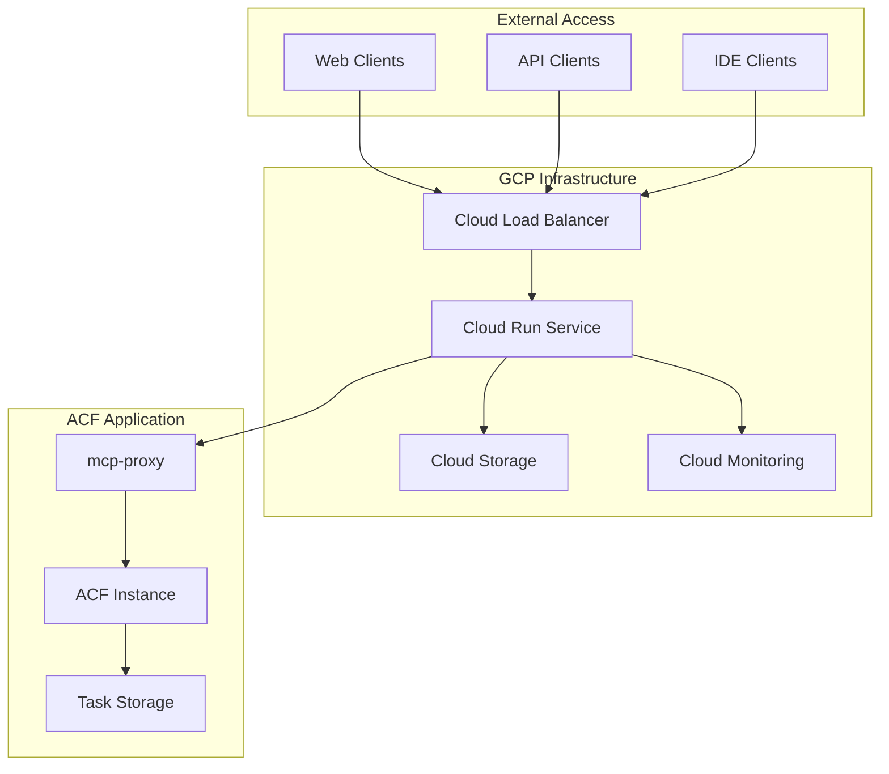
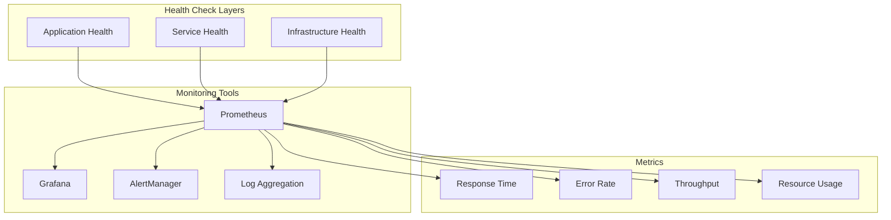
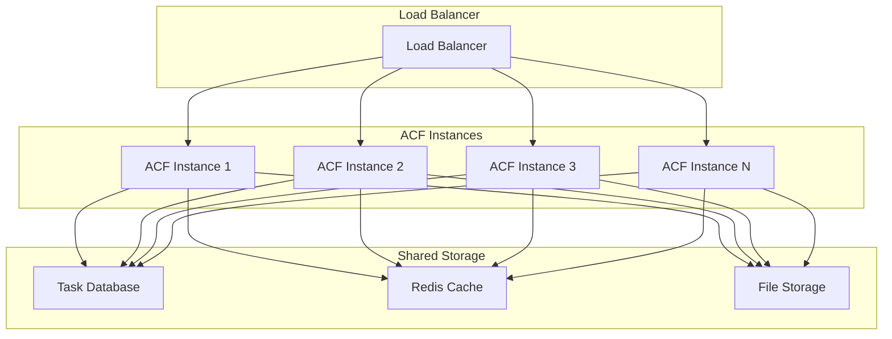

# ACF Deployment Guide

**Author:** Abhilash Chadhar (FutureAtoms)  
**Last Updated:** January 2025


## Deployment Options Overview



## 1. Local Development Setup

### Quick Start

```bash
# Clone repository
git clone https://github.com/your-org/agentic-control-framework.git
cd agentic-control-framework

# Install dependencies
npm install

# Make CLI tools executable
chmod +x bin/*

# Test CLI mode
./bin/acf init -n "Test Project"
./bin/acf add -t "Test task" -p high
./bin/acf list
```

### Local MCP Setup



#### Claude Code Configuration (Recommended)

**Local Development:**
```json
{
  "type": "stdio",
  "command": "node",
  "args": [
    "/path/to/agentic-control-framework/bin/agentic-control-framework-mcp",
    "--workspaceRoot",
    "/path/to/your/project"
  ],
  "env": {
    "ACF_PATH": "/path/to/agentic-control-framework",
    "WORKSPACE_ROOT": "/path/to/your/project",
    "READONLY_MODE": "false",
    "BROWSER_HEADLESS": "false",
    "DEFAULT_SHELL": "/bin/bash",
    "NODE_ENV": "production"
  }
}
```

**Remote Deployment:**
```json
{
  "mcpServers": {
    "agentic-control-framework": {
      "transport": {
        "type": "sse",
        "url": "https://your-deployment-url.com/sse"
      }
    }
  }
}
```

#### Cursor Configuration

```json
{
  "mcp.servers": {
    "acf-local": {
      "command": "node",
      "args": [
        "/path/to/agentic-control-framework/bin/agentic-control-framework-mcp",
        "--workspaceRoot",
        "/path/to/your/project"
      ],
      "env": {
        "WORKSPACE_ROOT": "/path/to/your/project",
        "ALLOWED_DIRS": "/path/to/your/project:/tmp",
        "READONLY_MODE": "false"
      }
    }
  }
}
```

#### Claude Desktop Configuration

```json
{
  "mcpServers": {
    "acf-local": {
      "command": "node",
      "args": [
        "/path/to/agentic-control-framework/bin/agentic-control-framework-mcp",
        "--workspaceRoot",
        "/path/to/your/project"
      ],
      "env": {
        "WORKSPACE_ROOT": "/path/to/your/project",
        "ALLOWED_DIRS": "/path/to/your/project:/tmp"
      }
    }
  }
}
```

## 2. Cloud Deployment

### Google Cloud Platform



#### GCP Deployment Steps

```bash
# 1. Setup GCP project
gcloud auth login
gcloud projects create acf-deployment-$(date +%s)
export GCP_PROJECT_ID="your-project-id"
gcloud config set project $GCP_PROJECT_ID

# 2. Enable required APIs
gcloud services enable run.googleapis.com
gcloud services enable cloudbuild.googleapis.com

# 3. Build and deploy
gcloud run deploy acf-service \
  --source . \
  --platform managed \
  --region us-central1 \
  --allow-unauthenticated \
  --port 8080 \
  --memory 1Gi \
  --cpu 1 \
  --max-instances 10

# 4. Get service URL
gcloud run services describe acf-service \
  --platform managed \
  --region us-central1 \
  --format 'value(status.url)'
```

### Railway Deployment

```yaml
# railway.json
{
  "build": {
    "builder": "NIXPACKS"
  },
  "deploy": {
    "startCommand": "npm start",
    "healthcheckPath": "/health",
    "healthcheckTimeout": 300,
    "restartPolicyType": "ON_FAILURE",
    "restartPolicyMaxRetries": 10
  }
}
```

```bash
# Deploy to Railway
npm install -g @railway/cli
railway login
railway init
railway up
```

### Fly.io Deployment

```toml
# fly.toml
app = "acf-deployment"
primary_region = "sjc"

[build]
  builder = "heroku/buildpacks:20"

[env]
  PORT = "8080"
  NODE_ENV = "production"

[http_service]
  internal_port = 8080
  force_https = true
  auto_stop_machines = true
  auto_start_machines = true
  min_machines_running = 0

[[http_service.checks]]
  grace_period = "10s"
  interval = "30s"
  method = "GET"
  path = "/health"
  timeout = "5s"

[vm]
  cpu_kind = "shared"
  cpus = 1
  memory_mb = 1024
```

```bash
# Deploy to Fly.io
npm install -g @fly.io/flyctl
fly auth login
fly launch
fly deploy
```

## 3. Container Deployment

### Docker Setup

```dockerfile
# Dockerfile
FROM node:22-alpine

WORKDIR /app

# Copy package files
COPY package*.json ./

# Install dependencies
RUN npm ci --only=production

# Copy application code
COPY . .

# Make CLI tools executable
RUN chmod +x bin/*

# Create non-root user
RUN addgroup -g 1001 -S nodejs
RUN adduser -S acf -u 1001

# Set ownership
RUN chown -R acf:nodejs /app
USER acf

# Expose port
EXPOSE 8080

# Health check
HEALTHCHECK --interval=30s --timeout=3s --start-period=5s --retries=3 \
  CMD curl -f http://localhost:8080/health || exit 1

# Start application
CMD ["npm", "start"]
```

### Docker Compose

```yaml
# docker-compose.yml
version: '3.8'

services:
  acf-proxy:
    build: .
    ports:
      - "8080:8080"
    environment:
      - NODE_ENV=production
      - PORT=8080
      - WORKSPACE_ROOT=/app/workspace
      - ALLOWED_DIRS=/app/workspace:/tmp
    volumes:
      - ./workspace:/app/workspace
      - ./data:/app/data
    restart: unless-stopped
    healthcheck:
      test: ["CMD", "curl", "-f", "http://localhost:8080/health"]
      interval: 30s
      timeout: 10s
      retries: 3
      start_period: 40s

  nginx:
    image: nginx:alpine
    ports:
      - "80:80"
      - "443:443"
    volumes:
      - ./nginx.conf:/etc/nginx/nginx.conf
      - ./ssl:/etc/nginx/ssl
    depends_on:
      - acf-proxy
    restart: unless-stopped

volumes:
  workspace:
  data:
```

### Kubernetes Deployment

```yaml
# k8s-deployment.yaml
apiVersion: apps/v1
kind: Deployment
metadata:
  name: acf-deployment
  labels:
    app: acf
spec:
  replicas: 3
  selector:
    matchLabels:
      app: acf
  template:
    metadata:
      labels:
        app: acf
    spec:
      containers:
      - name: acf
        image: acf:latest
        ports:
        - containerPort: 8080
        env:
        - name: NODE_ENV
          value: "production"
        - name: PORT
          value: "8080"
        - name: WORKSPACE_ROOT
          value: "/app/workspace"
        resources:
          requests:
            memory: "512Mi"
            cpu: "250m"
          limits:
            memory: "1Gi"
            cpu: "500m"
        livenessProbe:
          httpGet:
            path: /health
            port: 8080
          initialDelaySeconds: 30
          periodSeconds: 10
        readinessProbe:
          httpGet:
            path: /health
            port: 8080
          initialDelaySeconds: 5
          periodSeconds: 5
        volumeMounts:
        - name: workspace
          mountPath: /app/workspace
      volumes:
      - name: workspace
        persistentVolumeClaim:
          claimName: acf-workspace-pvc

---
apiVersion: v1
kind: Service
metadata:
  name: acf-service
spec:
  selector:
    app: acf
  ports:
    - protocol: TCP
      port: 80
      targetPort: 8080
  type: LoadBalancer

---
apiVersion: v1
kind: PersistentVolumeClaim
metadata:
  name: acf-workspace-pvc
spec:
  accessModes:
    - ReadWriteOnce
  resources:
    requests:
      storage: 10Gi
```

## 4. Proxy Configuration

### mcp-proxy Setup

```yaml
# mcp-proxy-config.yaml
servers:
  acf:
    command: node
    args:
      - bin/agentic-control-framework-mcp
      - --workspaceRoot
      - /app/workspace
    env:
      WORKSPACE_ROOT: /app/workspace
      ALLOWED_DIRS: /app/workspace:/tmp
      READONLY_MODE: "false"

proxy:
  port: 8080
  cors:
    enabled: true
    origins: ["*"]
  rateLimit:
    enabled: true
    windowMs: 900000  # 15 minutes
    max: 100  # limit each IP to 100 requests per windowMs
  
logging:
  level: info
  format: json
```

### Nginx Configuration

```nginx
# nginx.conf
events {
    worker_connections 1024;
}

http {
    upstream acf_backend {
        server acf-proxy:8080;
    }

    server {
        listen 80;
        server_name your-domain.com;

        location / {
            proxy_pass http://acf_backend;
            proxy_http_version 1.1;
            proxy_set_header Upgrade $http_upgrade;
            proxy_set_header Connection 'upgrade';
            proxy_set_header Host $host;
            proxy_set_header X-Real-IP $remote_addr;
            proxy_set_header X-Forwarded-For $proxy_add_x_forwarded_for;
            proxy_set_header X-Forwarded-Proto $scheme;
            proxy_cache_bypass $http_upgrade;
            proxy_read_timeout 86400;
        }

        location /sse {
            proxy_pass http://acf_backend/sse;
            proxy_http_version 1.1;
            proxy_set_header Upgrade $http_upgrade;
            proxy_set_header Connection 'upgrade';
            proxy_set_header Host $host;
            proxy_set_header X-Real-IP $remote_addr;
            proxy_set_header X-Forwarded-For $proxy_add_x_forwarded_for;
            proxy_set_header X-Forwarded-Proto $scheme;
            proxy_cache_bypass $http_upgrade;
            proxy_buffering off;
            proxy_read_timeout 86400;
        }
    }
}
```

## 5. Monitoring and Observability

### Health Checks



### Logging Configuration

```javascript
// logger.js configuration for production
const winston = require('winston');

const logger = winston.createLogger({
  level: process.env.LOG_LEVEL || 'info',
  format: winston.format.combine(
    winston.format.timestamp(),
    winston.format.errors({ stack: true }),
    winston.format.json()
  ),
  defaultMeta: { service: 'acf' },
  transports: [
    new winston.transports.File({ filename: 'error.log', level: 'error' }),
    new winston.transports.File({ filename: 'combined.log' }),
    new winston.transports.Console({
      format: winston.format.simple()
    })
  ]
});
```

## 6. Security Considerations

### Security Checklist

- [ ] **Authentication**: Implement proper authentication
- [ ] **Authorization**: Role-based access control
- [ ] **HTTPS**: Force HTTPS in production
- [ ] **Rate Limiting**: Prevent abuse
- [ ] **Input Validation**: Sanitize all inputs
- [ ] **File System**: Restrict file access
- [ ] **Process Isolation**: Sandbox command execution
- [ ] **Secrets Management**: Use environment variables
- [ ] **Monitoring**: Log security events
- [ ] **Updates**: Keep dependencies updated

### Environment Variables

```bash
# Production environment variables
NODE_ENV=production
PORT=8080
WORKSPACE_ROOT=/app/workspace
ALLOWED_DIRS=/app/workspace:/tmp
READONLY_MODE=false
LOG_LEVEL=info
RATE_LIMIT_ENABLED=true
CORS_ENABLED=true
HEALTH_CHECK_ENABLED=true
```

## 7. Scaling Strategies

### Horizontal Scaling



### Auto-scaling Configuration

```yaml
# Kubernetes HPA
apiVersion: autoscaling/v2
kind: HorizontalPodAutoscaler
metadata:
  name: acf-hpa
spec:
  scaleTargetRef:
    apiVersion: apps/v1
    kind: Deployment
    name: acf-deployment
  minReplicas: 2
  maxReplicas: 10
  metrics:
  - type: Resource
    resource:
      name: cpu
      target:
        type: Utilization
        averageUtilization: 70
  - type: Resource
    resource:
      name: memory
      target:
        type: Utilization
        averageUtilization: 80
```

This deployment guide provides comprehensive coverage of all deployment scenarios from local development to enterprise-scale cloud deployments.
