# ACF Tool Reference Guide

## Tool Ecosystem Overview

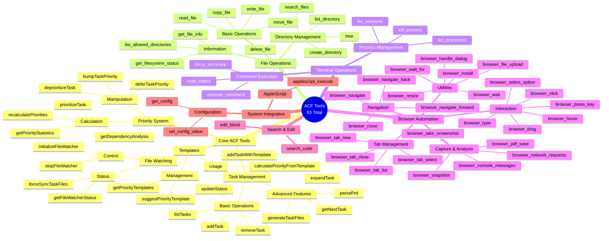

## Tool Categories

### 1. Core ACF Tools (33 tools)

#### Task Management Flow

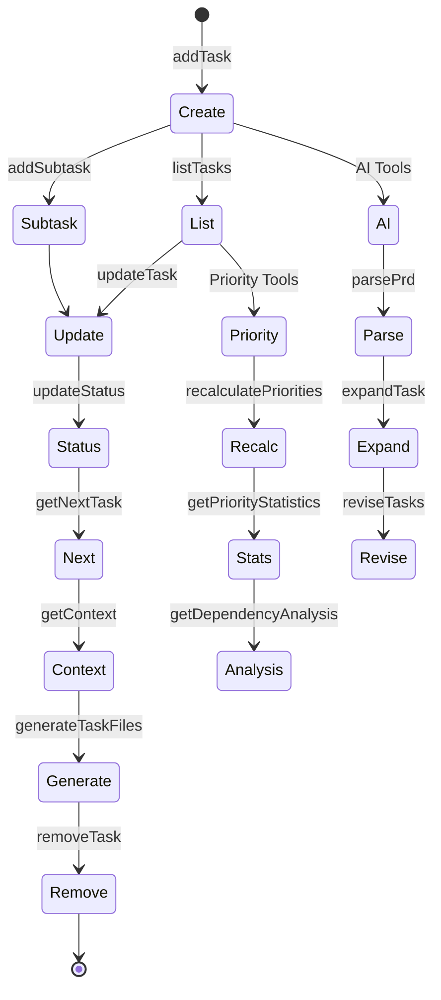

#### Priority System Tools

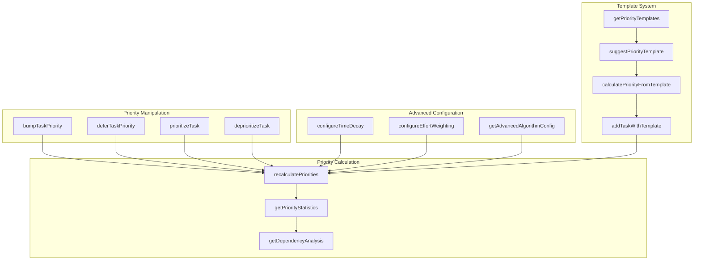

### 2. File Operations (12 tools)

#### File Operation Flow

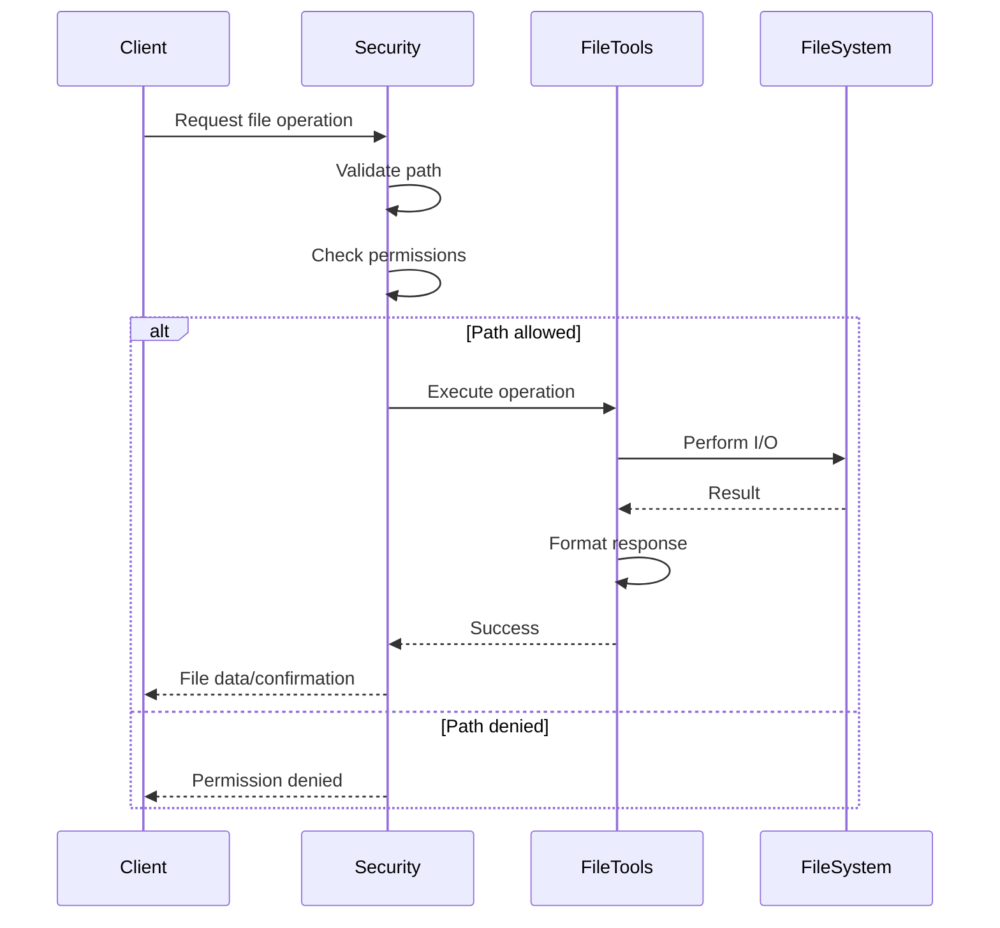

#### File Tools Hierarchy

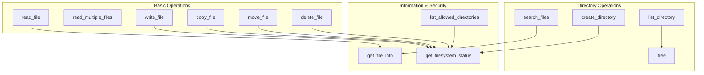

### 3. Terminal Operations (6 tools)

#### Terminal Tool Workflow

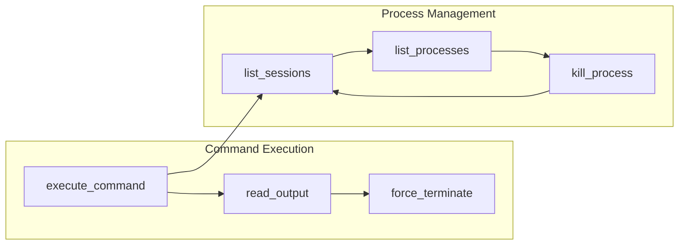

### 4. Browser Automation (25 tools)

#### Browser Automation Flow

```mermaid
stateDiagram-v2
    [*] --> Install: browser_install
    Install --> Navigate: browser_navigate
    Navigate --> Interact: Interaction Tools
    Interact --> Capture: Capture Tools
    Capture --> Manage: Tab Management
    Manage --> Close: browser_close
    Close --> [*]
    
    Navigate --> Back: browser_navigate_back
    Back --> Forward: browser_navigate_forward
    Forward --> Navigate
    
    Interact --> Click: browser_click
    Click --> Type: browser_type
    Type --> Hover: browser_hover
    Hover --> Drag: browser_drag
    Drag --> Select: browser_select_option
    Select --> Key: browser_press_key
    
    Capture --> Screenshot: browser_take_screenshot
    Screenshot --> Snapshot: browser_snapshot
    Snapshot --> PDF: browser_pdf_save
    PDF --> Console: browser_console_messages
    Console --> Network: browser_network_requests
    
    Manage --> List: browser_tab_list
    List --> New: browser_tab_new
    New --> Switch: browser_tab_select
    Switch --> CloseTab: browser_tab_close
```

#### Browser Tool Categories

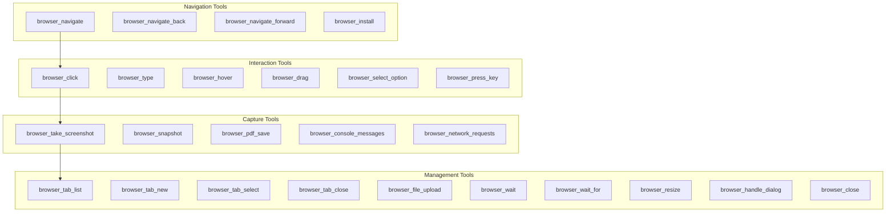

### 5. Search & Edit Tools (2 tools)

#### Search and Edit Workflow

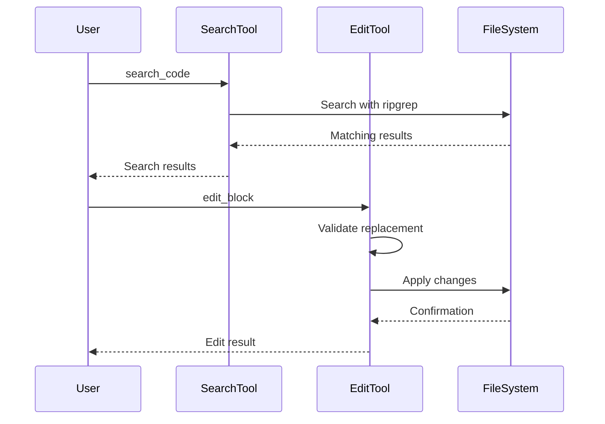

### 6. System Integration Tools

#### AppleScript Integration

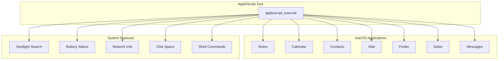

#### Configuration Tools

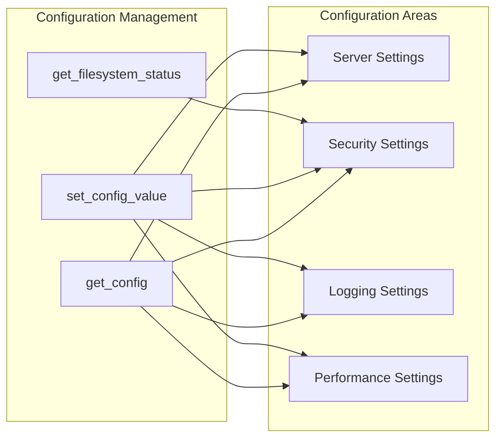

## Tool Usage Patterns

### Common Workflows

#### 1. Project Setup Workflow

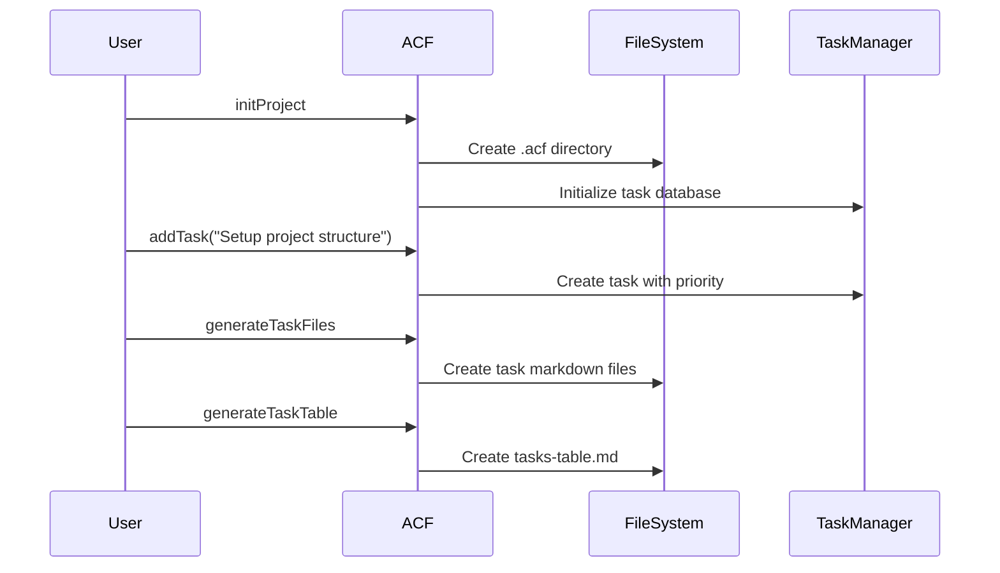

#### 2. Code Review Workflow

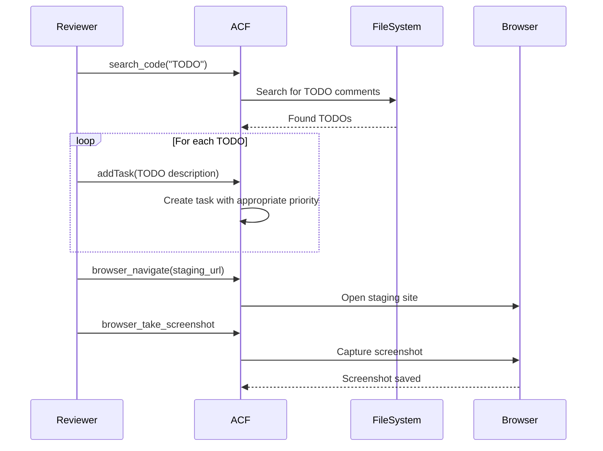

#### 3. Deployment Workflow

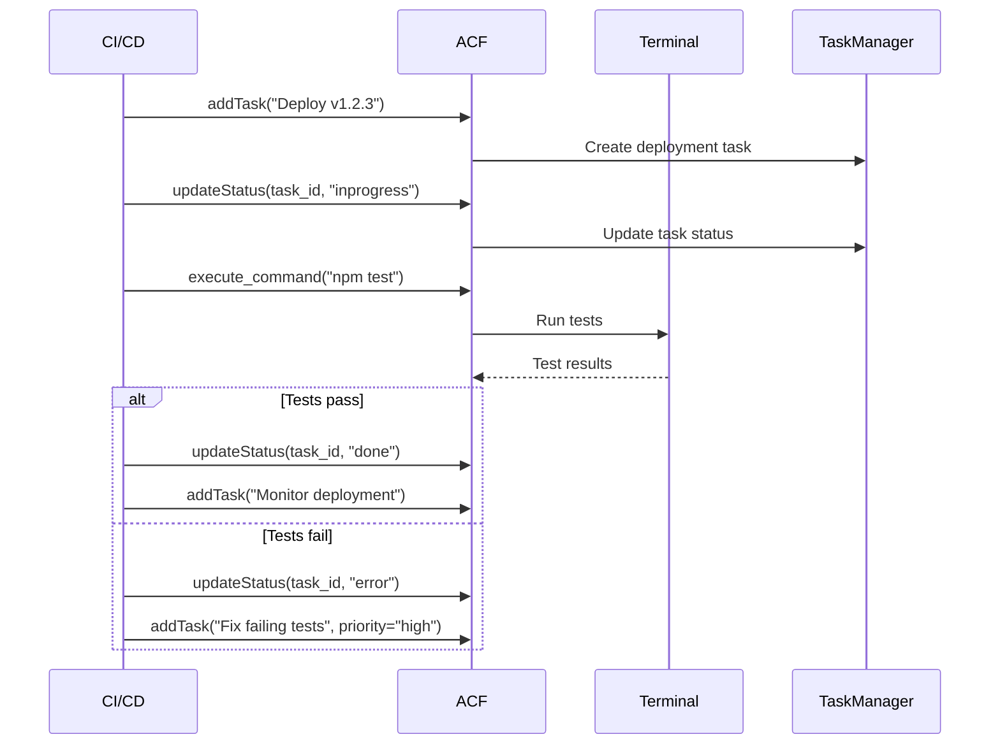

## Tool Performance Characteristics

### Response Time Categories

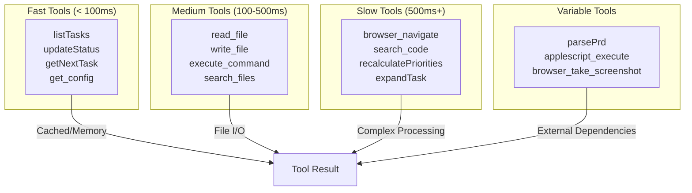

### Resource Usage Patterns

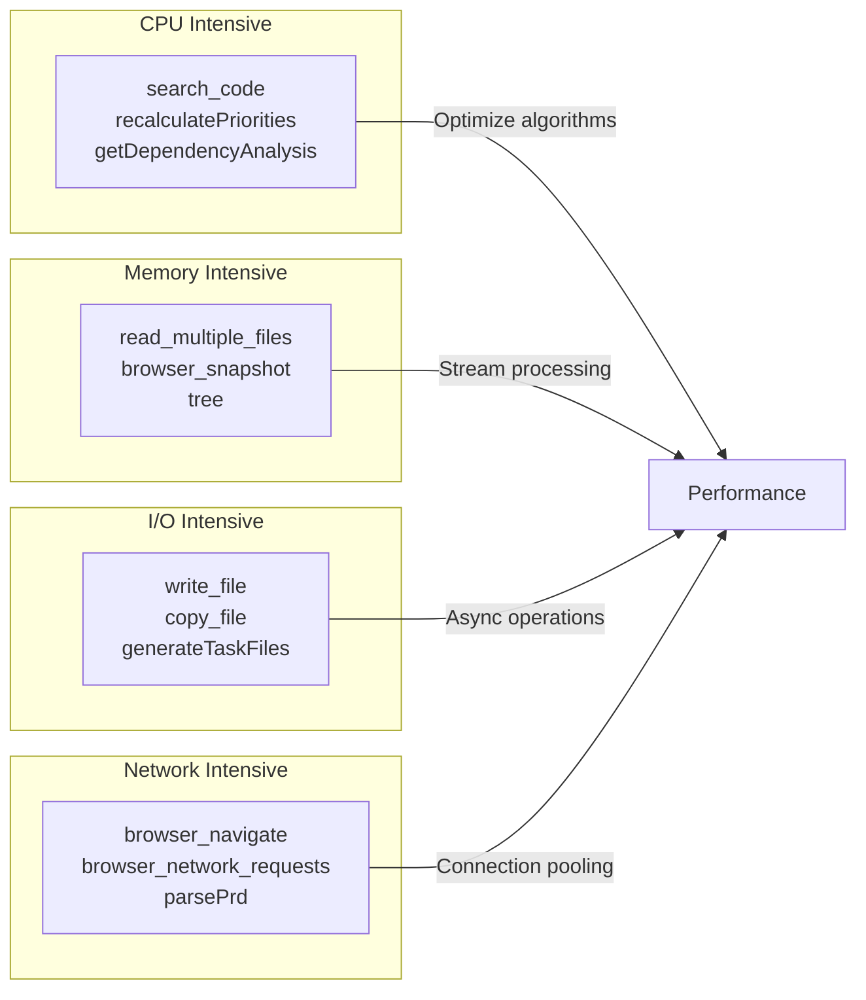

## Error Handling Patterns

### Tool Error Categories

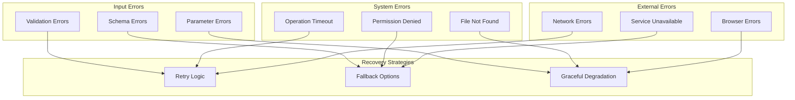

This tool reference provides comprehensive documentation for all 83 tools in the ACF ecosystem, including their relationships, workflows, and usage patterns.
